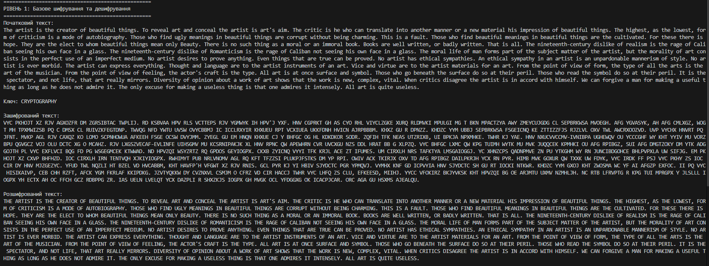
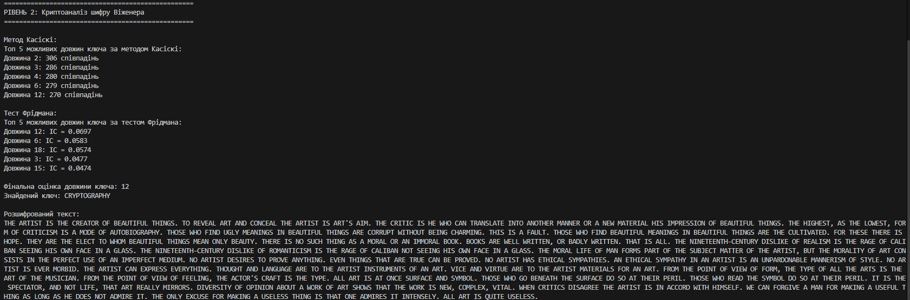
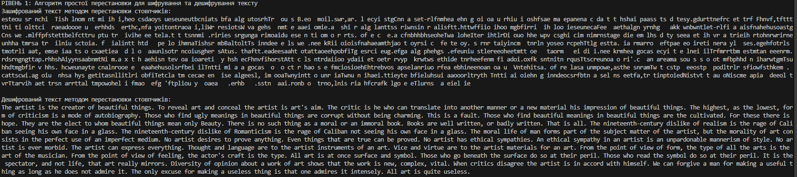
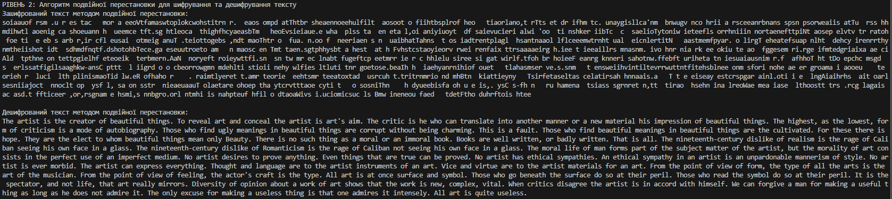
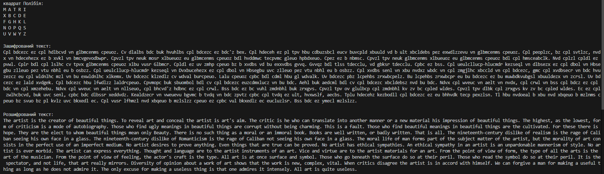
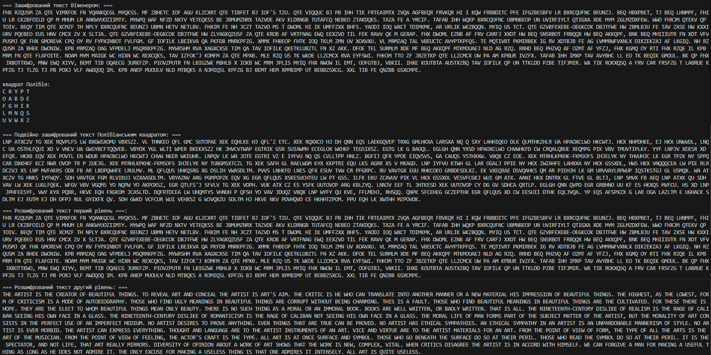

# goit-pnc-hw-02
Домашнє завдання до теми "Історія та приклади криптографічних перетворень"

## Завдання 1
Запускаємо скрипт `1_vigenere.py`, виконується зчитування тексту із файла `plain_tetx.txt`. Відбувається шифрування за допомогою алгоритма Віженера ключем `CRYPTOGRAPHY`.
Зашифрований текст також розшифровується і виводиться на стандартний вивід, щоб можна було переконатись, що алгоритм працює правильно.

Реалізація методу Касіскі більш складна ніж тесту Фрідмана для розшифровки тексту, зашифрованого шифром Віженера без відомого ключа. Для того щоб добитися надійної роботи тесту, довелося застосувати фільтр результатів. Суть роботи фільтру полягає у тому що він визначає довжину найбільшої підстроки із суттєвою частотою появи, кратну довжинам всіх інших підстрок із більшими частотами.
Результат роботи скрипта:

Після визначення довжини ключа шифру Віженера, стає можливим застосування частотного аналізу для знаходження значення ключа та розкриття криптограми.

## Завдання 2
Запускаємо скрипт `2_transpos.py` алгоритм простої перестановки для шифрування та дешифрування тексту, використовуючи перестановку засновану на фразі "SECRET"

Реалізовано шифр подвійної перестановки з використанням ключів "SECRET" та "CRYPTO" для шифрування та дешифрування. Після першого рівня шифрування, букви нового ключа використовуються для позначення рядків, усі літери, знаки і інші символи поточного тексту записуються послідовно в стовпці навпроти літер ключа. Далі шифрований текст формується з послідовно поєднанного тексту, що утворюється у рядку, один за одним відповідно послідовності ключа. 

## Завдання 3
Запускаємо скрипт `3_table_vig.py` - табличний шифр із використанням фрази-ключа "MATRIX". Використаємо його для шифрування та дешифрування тексту. Оскільки в описі ДЗ немає вказаного конкретного методу, який саме і яким чином треба використовувати - обираємо метод матриці Полібія (матриця 5х5)

Шифруємо текст використовуючи шифр Віженера з ключем "MATRIX", потім табличним шифром з ключем "CRYPTO".

Як бачимо, розшифрований текст першого рівня після подвійного шифрування повністю співпадає із зашифрованим текстом Віженера з першого рівня
